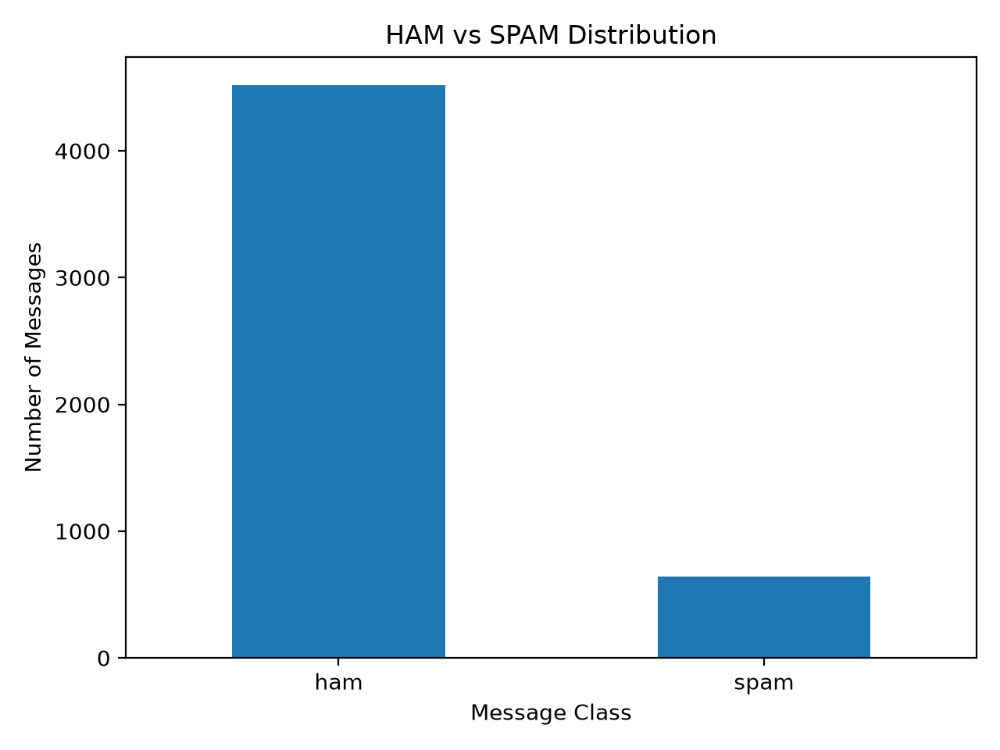
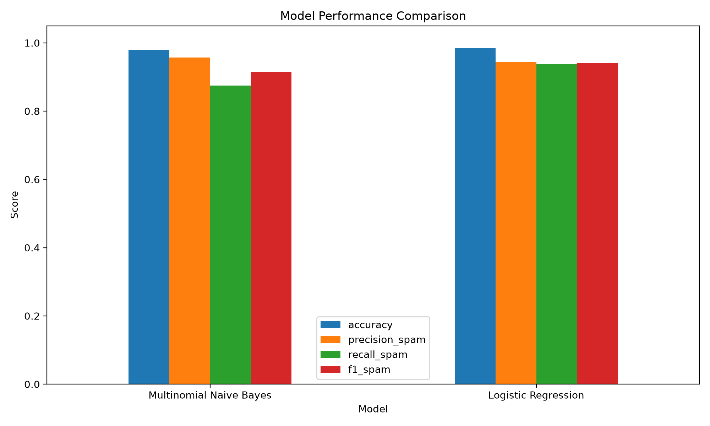
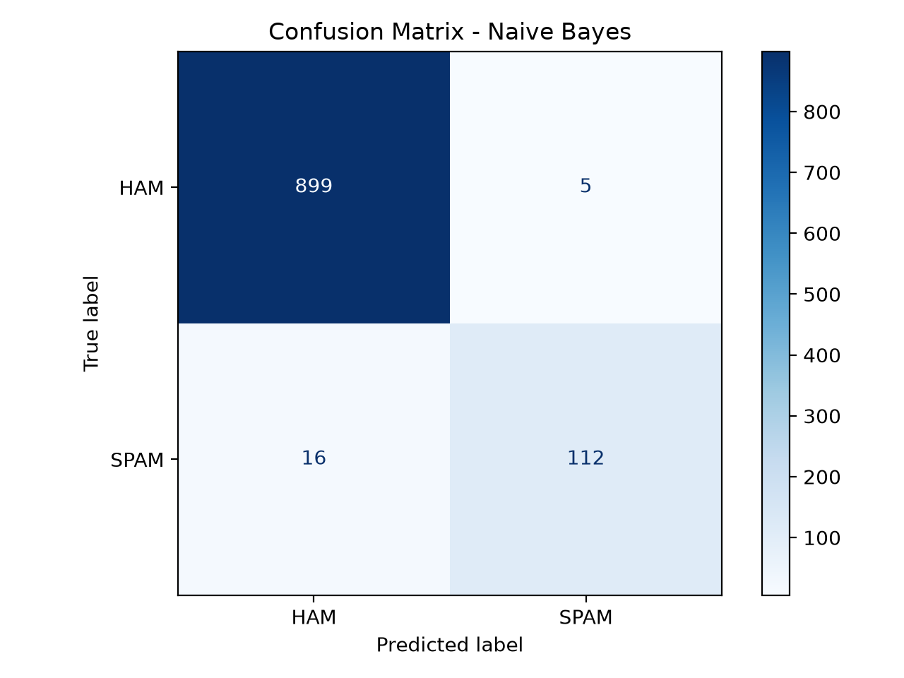

# Spam Message Detector

AI/ML Fellowship Project for SMS spam detection using TF-IDF, Multinomial Naive Bayes, Logistic Regression, and Streamlit.

## Overview

This project classifies SMS messages into two categories:

- **HAM** — legitimate messages
- **SPAM** — unwanted or suspicious messages

The project compares two classical machine-learning algorithms using the same TF-IDF text features:

1. Multinomial Naive Bayes
2. Logistic Regression

## Dataset

The project uses the **SMS Spam Collection Dataset**.

- Raw messages: 5,572
- Clean messages after preprocessing: 5,158
- HAM: 4,516
- SPAM: 642

The dataset is imbalanced, with significantly more HAM messages than SPAM messages.

## Machine Learning Pipeline

```text
SMS Dataset
    ↓
Data Cleaning
    ↓
80/20 Stratified Train-Test Split
    ↓
TF-IDF Vectorization
    ↓
Multinomial Naive Bayes
        +
Logistic Regression
    ↓
Evaluation
    ↓
Model Comparison
```

## TF-IDF Configuration

The text is converted into numerical features using:

- `lowercase=True`
- `ngram_range=(1, 2)` for unigrams and bigrams
- `sublinear_tf=True`

The fitted vocabulary contains approximately **42,236 features**.

## Models

### Multinomial Naive Bayes

```python
MultinomialNB(
    alpha=0.3,
    fit_prior=False,
)
```

### Logistic Regression

```python
LogisticRegression(
    C=2.0,
    class_weight="balanced",
    max_iter=1500,
    random_state=42,
)
```

## Results

| Model | Accuracy | Spam Precision | Spam Recall | Spam F1 |
|---|---:|---:|---:|---:|
| Multinomial Naive Bayes | 97.97% | 95.73% | 87.50% | 91.43% |
| Logistic Regression | 98.55% | 94.49% | 93.75% | 94.12% |

**Logistic Regression performed better overall**, mainly because it achieved higher spam recall and F1-score.

## Visual Results

### Class Distribution



### Model Comparison



### Naive Bayes Confusion Matrix



### Logistic Regression Confusion Matrix


## Streamlit App

The Streamlit app allows a user to enter an SMS message and compare predictions from both trained models.

Run it with:

```bash
streamlit run app.py
```

## Train the Models

Install dependencies:

```bash
pip install -r requirements.txt
```

Run training:

```bash
python train_models.py
```

The trained vectorizer and models are saved inside the `models/` directory.

## Project Structure

```text
Spam-Message-Detector/
├── app.py
├── train_models.py
├── spam.csv
├── requirements.txt
├── README.md
├── .gitignore
├── models/
│   ├── vectorizer.joblib
│   ├── multinomial_naive_bayes.joblib
│   └── logistic_regression.joblib
├── outputs/
│   ├── class_distribution.png
│   ├── confusion_matrix_naive_bayes.png
│   ├── confusion_matrix_logistic_regression.png
│   ├── model_comparison.csv
│   └── model_comparison.png
└── presentation/
    └── Spam-Message-Detector_Final.pptx
```

## Team Members

- Abdullah Javed
- [Team Member 2]
- [Team Member 3]
- [Team Member 4]

## Technologies

Python, Pandas, Scikit-learn, TF-IDF, Multinomial Naive Bayes, Logistic Regression, Matplotlib, Joblib, and Streamlit.

## Presentation

The final project presentation is available at:

`presentation/Spam-Message-Detector_Final.pptx`

## Acknowledgment

Built as part of our AI/ML Fellowship Project.
